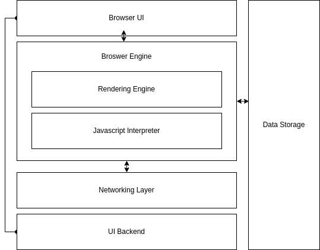

# Web Browser Deep Dive

A web browser’s main function is to display requested web resources in a window.  During the early days of the internet, there were a lot of browsers which used to display and render web-pages as how they wanted but this is not the case anymore. With the intervention of W3C, which is an organisation responsible for upholding and defining new standards of the web nowadays how the browsers render HTML and CSS is defined by the specifications maintained by W3C.

Whenever you enter a URL for the browser to load, the following process is kick started:

### DNS Lookup

Identifying the locations of the resources needed to create a web page is the first stage in the navigation process.  If you navigate to https://www.google.com, a DNS lookup must take place if you've never been to a website before. Once a name server has processed your browser's DNS lookup request and returned an IP address, the DNS lookup process is complete. After this first request, the IP address is probably cached for a while, which speeds up subsequent queries by getting the IP address from the cache rather than calling a name server once more.

### TCP Handshake

Once the IP address is obtained, the browser uses a TCP three-way handshake to establish a connection with the server. The purpose of this method is to allow two entities that are trying to communicate—in this case, the web server and browser—to negotiate the network TCP socket connection's parameters before sending data, typically through HTTPS.

Once the browser receives the first chunk of data, it can begin parsing the information received. And this is the most important part of the entire process and something which we’re going to focus on. To understand this better, we need to understand how a browser is architected and what are it’s essential components. The architecture and functional components of a browser mostly remain the same across all the browsers and are listed, illustrated and described as follows

### User Interface

The User Interface is the starting point at which an end user interacts with the browser. Among other things, it primarily has an address bar, a bookmarks bar, and navigation controls.
There are no formal guidelines for how a browser should be designed, yet the majority of browsers share a similar interface. This is because the interface has evolved over the years after taking usage trends and best practises into account.

### Browser Engine

Between the user interface and the rendering engine, the Browser Engine functions as a bridge. When you enter a URL in the address bar, the browser engine sends that URL to the rendering engine, which then requests that it process the incoming data from that URL.

### Rendering Engine

Is the core part of the browser and works closely with the networking engine and is responsible for displaying the contents of a web-page on the browser screen.

Majorly, there are three rendering engines in the market right now.

Firefox uses Mozilla’s own rendering engine called as Gecko. Safari uses WebKit and Chrome uses Blink which essentially is a fork of WebKit.

In all of these rendering engines, the essential flow is same. There are three main functions that the rendering engine is to perform. Those are:

1. Parsing
2. Layout
3. Publish

This entire process of parsing the HTML/CSS and painting the page on the screen is called as the the Critical Rendering Path which according to MDN WebDocs is

> a sequence of steps the browser goes through to convert the HTML, CSS and JavaScript into pixels on the screen
>

### Parsing

Before the HTML/CSS files received from a web server are painted on the browser window, they need to be parsed. Both HTML and CSS are parsed using different parser respectively, at the end of this parsing process, the aim is to produce two tree models: Document Object Model (DOM) and CSS Object Model (CSSOM). These two models are then used by the renderer to paint the page on the screen.

The DOM is the internal representation of the markup for the browser and can be manipulated through various APIs in JavaScript. In the same way, CSS Object Model ****is a also set of APIs allowing the manipulation of CSS from JavaScript

Since Parsing is such an essential part of the entire process, let’s cover that in detail. The core steps in both HTML and CSS parsers are the same and can be grouped into the following steps:

1. **********Pre-Processing:**********

    The input stream received from the networking layer is initially processed to make the next step which is tokenization easier.

2. **************************Tokenisation:**************************

    The process of tokenisation in a broader sense is just the breaking of a stream of characters into discrete tokens(smallest meaningful items) defined by the particular grammar—in this case, HTML, a token is usually akin to a word in spoken language.

    Each and every entity within the HTML/CSS file is represented as a token and carries all the associated data with it. As soon as a token is created, the next step which is the Tree Construction step takes care of the token.

3. **Tree Construction:**

    This step is responsible for processing the tokens received from the previous step and dynamically updating the DOM/CSSOM trees. The browsers uses the trees built in this stage for rendering purposes

    

    If any external resource tokens (like image or link) are received, a request is sent to the browser’s network engine to fetch that resource. In particular if any script tokens are received, this can be a blocking operation as any external JS file might modify the DOM/CSSOM

### Creation of a Layout

Layout is the process by which the width, height, and locations of all the nodes in the render tree are decided, along with the placement of each object on the page. The first time the size and position of nodes are determined is called *layout.* Subsequent recalculations of node size and locations are called *reflows*

### Painting the Web Page

The last step in the critical rendering path is the painting of individual nodes on the screen. The first occurrence of it is called the first meaningful paint. In this step, the browser converts each object calculated in the layout phase into actual pixels on the screen. This is an all encompassing process which includes text, colors, borders, buttons, images etc.

## Javascript Engine

The JavaScript Engine is used to parse and execute JavaScript code on the DOM or CSSOM. The JavaScript code is provided by the web server, or it can be provided by the web browser (browser extensions or features of the browser like automatic ad-blocking).  Early browsers used JavaScript interpreters, but modern JavaScript engines use Just-In-Time compilation for improved performance.

Examples of JavaScript Engine include

- Chrome - V8 JavaScript Engine
- Safari - JavaScriptCore
- FireFox - SpiderMonkey Engine

## Networking Layer

The purpose of the networking layer of a browser is to abstract away the handling of TCP or UDP sockets so that the web application doesn’t have to deal with that. It handles the right connection limits, formatting of requests, dealing with proxies, caching and much more and provides the requested HTML/CSS files for the browser engine to process

## UI Backend

This layer is responsible for driving the UI of the browser itself. It mostly uses the OS methods underneath to capture, process and display user inputs.

## Data Storage

The browser needs to save data locally (cookies, cache, etc.) so the Data Storage component handles this part. Modern browsers also support storage mechanisms like localStorage, IndexedDB, and FileSystem.