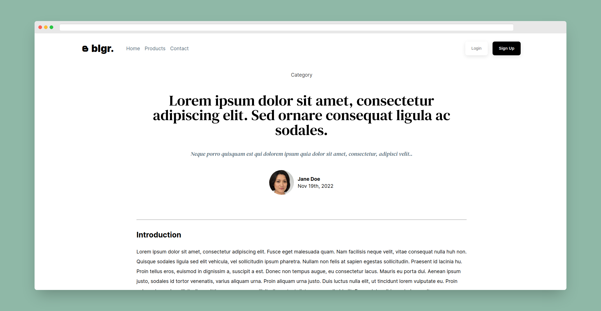
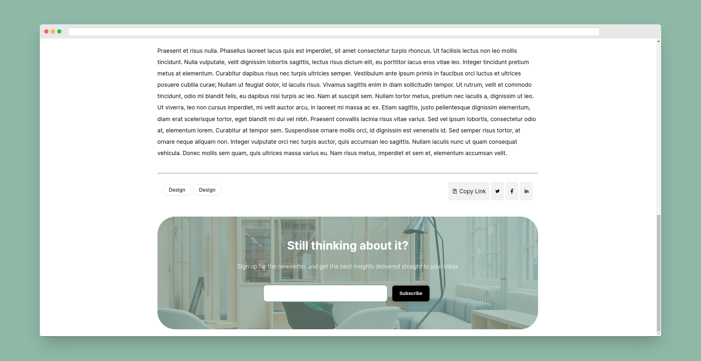

In this exercise, I have created a page representing a blog post where I have used the following concepts:

1. CSS Grid for layouts
2. Flexbox for individual components
3. A variety of CSS selectors
4. Pseudo Elements and Pseudo Classes
5. CSS Transitions
6. Semantic HTML components